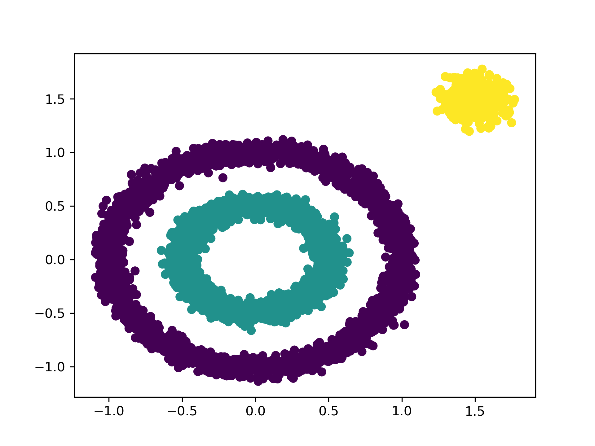

  
## DBSCAN SIMPLE EXAMPLE

### 思路
- 1.准备待聚类数据data，并初始化visit_list为全0，shape与data的数据个数一直，初始化class_list为全-1(-1表示噪声，0,1,2表示类别),label=-1
- 2.遍历待聚类数据
- 3.若当前数据已被访问，则跳过, if visit_list[i]==1
- 4.若当前数据未被访问，则找出邻域eps内的点，若点数大于minPts，则该点为核心点，更新label=label+1, class_list[i] = label
- 5.将邻域内的未被访问的可达点作为search_list（除自身外）
- 6.若search_list不为空：while(len(search_list) > 0)
- 7.从search_list中选择一个点，并从list中将其剔除
- 8.判断该点是噪点，获取该点下标更在class_list中更新其label
- 9.若该点未被访问，则判断该点领域内的点的数量是否小于min_pts；
- 10.将其中已被访问并且是噪声点筛选出来
- 11.将这些噪声点对应的标签换为label
- 12.将领域内未被访问的点提取出来，将其添加至search_list后面并去重，重新赋值search_list
-------------------
- 总体思想为：
- 找到一个领域内点数大于minpts的点，修改内点的类别，然后遍历领域内点列表search_list，遍历的点冲search中去除，
- 判断内点是否是核心，是的话则将内心的联通点叠加到search_list后面并去重.

### HOW TO RUN?  
- run main.py

### VISUALIZE EXAMPLE

### INFERENCE
- https://www.bbbdata.com/text/5